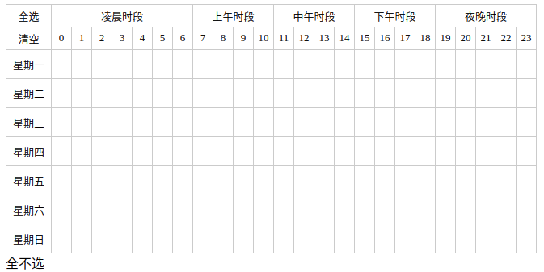

## 介绍
本组件实现了选择一周中的某个时间段功能。可通过拖拽选择和点击选择时间段。




## 使用场景
1. 广告投放时段选择

## 安装使用

``` bash
 npm i vue-week-time --save
```
```html
<template>
    <week-time :weekTimes='weekTimes'
                @change='weekTimeChange'></week-time>
</template>

<script>
import WeekTime from 'vue-week-time'
export default {
    components: {
        'week-time': WeekTime,
    },
    data() {
        weekTimes: {},
    },
    methods: {
        weekTimeChange(weekTimes, weekTimeStr) {
            // ...do something what you want hey!
        }
    }
}
</script>
```
## 参数(parmas)
| props        | default       |
| -------------|:-------------:|
|  weekTime    |  {}           |
|  local       |  {}           |

`weekTimes` 它包含键为1-7的7个属性,依次代表周一到周日，当缺少键是会默认补充，并赋值为空数组。属性值为一个包含0-23的数组，分别代表选中的某个小时，如下：

```js
 {
     1: [0, 1, 2, 3], // 选中了周一的0-3时
     2: [0, 1, 2, 3, 4, 5, 6, 7, 8, 9, 10, 11, 12, 13, 14, 15, 16, 17, 18, 19, 20, 21, 22, 23], // 周二全选
     3: [20, 21, 8, 9], // 周三选中8-9时，20-21时
     4: [], // 周四未选
     5: [],
     6: [],
     7: []
 }
```
`local`支持多语言，对应关系如下

```js
{
  0: '星期一',
  1: '星期二',
  2: '星期三',
  3: '星期四',
  4: '星期五',
  5: '星期六',
  6: '星期日',
  7: '全选',
  8： '清空',
  9: '凌晨时段',
  10: '上午时段',
  11: '中午时段',
  12: '下午时段',
  13: '夜晚时段',
}

```
## 回调事件(event callback)`change`
weekTime组件初始化（mounted）和拖动选择时间时会触发change事件，回调参数有两个，分别是weekTime对象和经过语义化解析的weekTime字符串。

## something else
license: MIT

issue:  [这里](https://github.com/hanrongliao/vue-week-time/issues)
